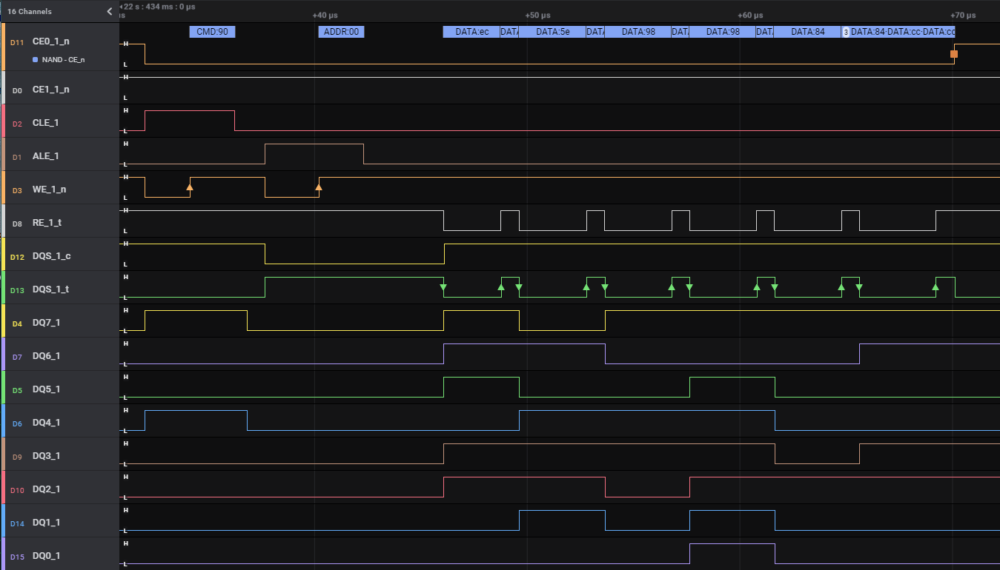

# NandAnalyzer
NAND (JEDEC / ONFI) Analyzer for Saleae Logic

The plugin was only tested against NV-DDR2 traces (and I use the term "test" lightly).

You can process traces with less then 8 data bits at a time and merge them in a post-process step, assuming the traffic is identical between runs (timing doesn't need to match - just order). This is helpful because the Saleae Pro 16 can only do 500MS/s on 6 channels, so it's not possible to capture 8bit bus at full speed in single trace. Use the "Export to TXT/CSV" feature to get usable data out of this plugin.



## build
clone the repo with submodules

### msvc / vscode
using "cmake tools" extension, configure for Release build with VS - amd64 and build.

### msvc / cmdline
```
"c:\Program Files (x86)\Microsoft Visual Studio\2022\Community\VC\Auxiliary\Build\vcvarsall.bat" amd64
```
(or equivalent for your installation / start environment from appropriate start menu entry)

```
mkdir build && cd build
cmake .. -GNinja && ninja
```

## usage
add the path containing the dll to Logic (Preferences -> Custom Low Level Analyzers), or copy dll to existing setup path.
